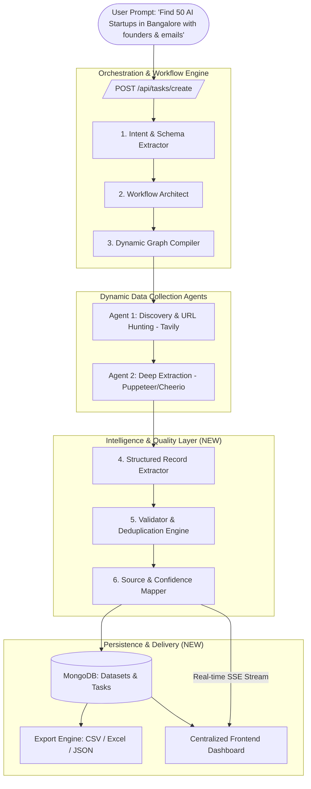

# 🚀 AI-Powered Data Intelligence Platform: Comprehensive Gap Analysis & Execution Blueprint

---

## 📌 Executive Summary
Aapke current backend ka **65% - 70% core engine already ready** hai. 
LangGraph, Dynamic Runtime Graph Compilation, Puppeteer Web Scraping, Tavily Search, aur SSE Streaming pehle se implement hain.

Lekin current system ek **General Chatbot** ki tarah kaam kar raha hai (jo Markdown text return karta hai). Problem Statement ki demand ek **"Data Intelligence & Extraction Platform"** ki hai jo **Structured, Source-Backed, Cleaned & Deduplicated Datasets** bana kar de, aur ek **Centralized Dashboard** me task management aur export provide kare.

---

## 🔍 Detailed Feature Match & Gap Analysis

| Problem Statement Requirement | Aapke Codebase me Abhi Kya Hai | Status | Kya Banana / Badlna Baki Hai |
| :--- | :--- | :---: | :--- |
| **1. Natural Language Data Requirements** | `intent.node.js` intent aur domain extract karta hai. | 85% Matched | Extraction schema ko enhance karna taaki ye target columns (fields) detect kare. |
| **2. Dynamic Workflow Design & Execution** | `architect.node.js` + `compileRuntimeGraph.js` dynamic agents compile karte hain. | 95% Matched | Data extraction pipeline ke specific sub-tasks (Scrape -> Extract -> Clean -> Deduplicate) ke prompts refine karna. |
| **3. Web Scraping & Multi-source Collection** | `webScraper.tool.js` (Cheerio), `advancedBrowser.tool.js` (Puppeteer), `webSearch.tool.js` (Tavily). | 80% Matched | Domain rate-limiting aur structured JSON extraction schemas add karna. |
| **4. Clean, Structure, Validate & Deduplicate** | Abhi koi dedicated cleaning ya deduplication module nahi hai. | ❌ **Missing** | Dedicated **Deduplication Node** + **Zod Data Validator** banana. |
| **5. Traceable, Source-Backed Data** | Search tool URLs return karta hai, lekin row-level mapping nahi hai. | ⚠️ **Partial** | Har extracted row me `_sourceUrl`, `_extractedAt`, aur `_confidence` attach karna. |
| **6. Dataset & Workflow History Storage** | Abhi sirf `Conversation` aur `Message` models hain. | ⚠️ **Partial** | **`Dataset.model.js`** aur **`WorkflowTask.model.js`** create karna MongoDB me. |
| **7. Search, Filter & Export Datasets** | Sirf text chat output stream hota hai. | ❌ **Missing** | Table querying API (sort/filter/paginate) + **CSV, JSON, Excel Export Engine**. |
| **8. Task Monitoring & Management** | Live SSE events hain (`type: "status"`). | 60% Matched | Task status lifecycle (`QUEUED`, `RUNNING`, `COMPLETED`, `FAILED`, `CANCELLED`) with cancel API. |
| **9. Centralized Interactive Dashboard** | Sirf backend API maujood hai. | ❌ **Missing** | React/Vite/Next.js UI jisme Prompt input, Live execution progress, Interactive Data Table, Source Inspector aur Export buttons hon. |

---

## 🛠️ Architecture Transformation: Chatbot ➡️ Data Intelligence Platform



---

## 📋 Complete Step-by-Step Implementation Roadmap

### Step 1: Database Models Banana (`Dataset` aur `WorkflowTask`)
* **File:** `src/modules/dataset/dataset.model.js`
  - `userId`: Task chalane wale ka ID.
  - `name`: Dataset ka title (e.g., "Bangalore AI Startups").
  - `schemaDefinition`: Fields ki list (`[ { field: "company", type: "string" }, { field: "email", type: "string" } ]`).
  - `records`: Array of objects with data fields + `_sourceUrl`, `_timestamp`, `_confidence`.
  - `totalRecords`: Count.
  - `sources`: Array of all visited domains/URLs.
* **File:** `src/modules/task/task.model.js`
  - `status`: `"QUEUED" | "PLANNING" | "COLLECTING" | "CLEANING" | "COMPLETED" | "FAILED"`.
  - `progress`: Number (0-100%).
  - `datasetId`: Linked dataset.
  - `logs`: Array of execution logs.

### Step 2: Extraction & Deduplication Node Banana
* **File:** `src/ai/nodes/dataExtractor.node.js`
  - Unstructured text se structured JSON array nikalna.
* **File:** `src/ai/nodes/dataDeduplicator.node.js`
  - Key fields (e.g. Website URL, Email, or Name) ke basis pe exact match aur fuzzy match karke duplicates remove karna.
  - Missing values clean karna, whitespace trim karna, email/phone format validate karna.

### Step 3: Dataset Querying & Export Engine Banana
* **File:** `src/modules/dataset/dataset.controller.js`
  - `GET /api/datasets`: All historical datasets.
  - `GET /api/datasets/:id`: Dataset details with pagination, sorting, search keyword.
  - `GET /api/datasets/:id/export?format=csv|json|xlsx`: File download endpoint.
* **Libraries to use:**
  - `json2csv` (CSV export ke liye).
  - `xlsx` / `exceljs` (Excel sheets ke liye).

### Step 4: Permitted Sources & Politeness Engine
* Scraper me checks:
  - `robots.txt` verification.
  - Concurrent request throttling (domain ban hone se bachane ke liye).

### Step 5: Centralized Interactive Dashboard (Frontend)
Ek modern frontend UI (React + Vite + Tailwind CSS / Vanilla CSS):
1. **Prompt & Configuration Bar:** Requirement type karne ke liye.
2. **Workflow Progress Tracker:** Stepper component jo SSE stream sunta hai (`Planning` ➡️ `Scraping 12/50` ➡️ `Deduplicating` ➡️ `Ready`).
3. **Interactive Data Table:**
   - Multi-column sort & filter.
   - Global search bar.
4. **Source Inspector Drawer:** Kisi bhi row pe click karne par right-side drawer khulega jo dikhayega ki ye information kis URL aur page snippet se aayi hai.
5. **Export Modal:** Single-click CSV / Excel export button.

---

## 🛠️ Required Tech Stack Additions

```json
{
  "dependencies_to_add": {
    "json2csv": "^6.0.0",
    "exceljs": "^4.4.0",
    "robots-parser": "^3.0.1",
    "fastest-levenshtein": "^1.0.16"
  }
}
```

---

## 🎯 Final Outcome Checklist
- [x] Natural language intent understanding *(Implemented in intent.node.js)*
- [x] Dynamic LangGraph compilation *(Implemented in compileRuntimeGraph.js)*
- [x] Multi-agent scraping (Puppeteer + Cheerio + Tavily) *(Implemented in src/ai/tools)*
- [x] Structured Schema & Data Extractor Node *(Implemented in dataExtractor.node.js)*
- [x] Deduplication & Data Validation Engine *(Implemented in dataDeduplicator.node.js)*
- [x] Source Traceability Metadata injection *(Implemented with clickable URL & confidence scoring)*
- [x] MongoDB Dataset & Task Models *(Implemented in src/modules/dataset and src/modules/task)*
- [x] CSV/Excel/JSON Export API *(Implemented in dataset.service.js with json2csv)*
- [x] Centralized Interactive Dashboard UI *(Implemented in Agentic_system_frontend)*
