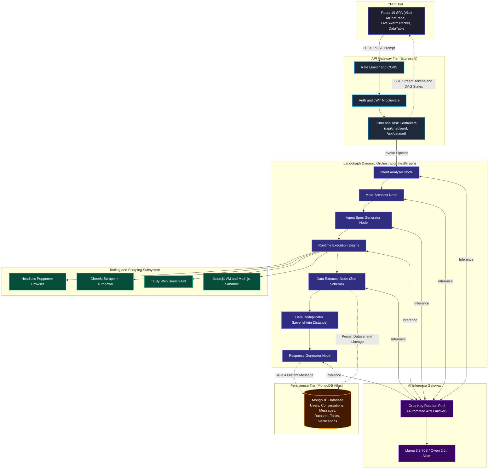
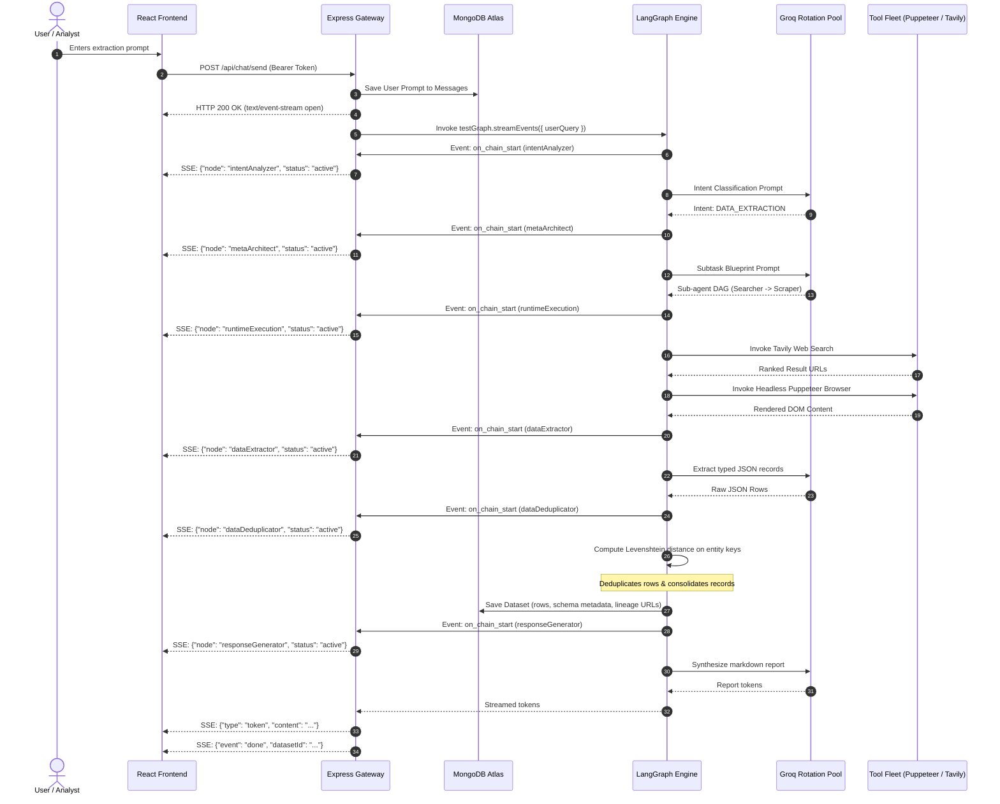

# Autonomous Agentic Data Engineering & Swarm Intelligence Platform (Backend)

A production-grade, multi-agent AI data engineering backend built with **Node.js (Express 5)**, **LangChain / LangGraph**, **MongoDB (Mongoose 9)**, and **Groq Key Rotation**.

The platform deconstructs unstructured natural-language requests, plans dynamic multi-agent DAGs at runtime, executes web scraping/search swarms, normalizes extracted tabular entities, and performs fuzzy Levenshtein deduplication before streaming structured records to the client over Server-Sent Events (SSE).

> 📄 **Complete Architecture Specification**: See [SYSTEM_ARCHITECTURE.md](./SYSTEM_ARCHITECTURE.md) or [docs/SYSTEM_ARCHITECTURE.md](./docs/SYSTEM_ARCHITECTURE.md) for full 17-section technical documentation.

---

## 1. High-Level Architecture

The system operates on an autonomous **Compiler and Dynamic Runtime Execution Graph** (`src/ai/graphs/test.graph.js`).



---

## 2. Core Execution Pipeline

When a user initiates an extraction task via `/api/chat/send`:



---

## 3. Key Subsystems

### 3.1 LangGraph Orchestration Nodes (`src/ai/nodes/`)
- **`intent.node.js`**: Analyzes user intent (Extraction, Research, Dataset Query, General Chat).
- **`architect.node.js`**: Decomposes high-level extraction prompts into executable sub-agent DAG blueprints.
- **`agentSpecification.node.js`**: Binds system prompts, output constraints, and tools to dynamic sub-agents.
- **`runtime.node.js`**: Ephemerally executes compiled agents with dependency resolution.
- **`dataExtractor.node.js`**: Normalizes unstructured agent traces into validated JSON schemas.
- **`dataDeduplicator.node.js`**: Computes fuzzy edit-distance metrics (`fastest-levenshtein`) to purge duplicate entities.
- **`datasetChat.node.js`**: Enables in-situ conversational querying over saved datasets.
- **`responseGenerator.node.js`**: Produces markdown executive summaries and analytical reports.

### 3.2 Tool & Web Scraping Ecosystem (`src/ai/tools/`)
- **`advancedBrowser.tool.js`**: Headless Puppeteer Chrome cluster; handles dynamic SPA client-side rendering and asset blocking.
- **`webScraper.tool.js`**: High-throughput static HTML scraper with Cheerio and Turndown Markdown conversion.
- **`webSearch.tool.js`**: Tavily and DuckDuckGo API integration for live SERP retrieval.
- **`jsExecution.tool.js` & `calculator.tool.js`**: Isolated Node.js VM context and Math.js engine for transformations.
- **`databaseAnalytics.tool.js`**: Statistical distributions, sums, averages, and group-by calculations.

### 3.3 Groq Rotation Pool & Resilience (`src/config/groqRotation.js`)
- Dynamically cycles across multiple Groq API keys on HTTP 429 quota exhaustion.
- Automated exponential jitter backoff via `src/utils/retryWithRateLimit.js`.
- Multi-model registry supporting **Llama 3.3 70B**, **Qwen 2.5 32B**, **Llama 3.1 8B**, and **Gemini 2.0**.

---

## 4. Database Schema (MongoDB Mongoose 9)

- **`User`**: Account credentials, bcrypt hash, role (`user`/`admin`), refresh tokens.
- **`Verification`**: Encrypted OTPs for email validation with 10-minute automatic TTL index expiration.
- **`Conversation`**: Chat threads, pinned flags, last message timestamps, auto-generated titles.
- **`Message`**: Chat history, role (`user`/`assistant`), token counts, node execution traces.
- **`Dataset`**: Primary extracted tabular entities, schema definition, provenance lineage, export records.
- **`Task`**: Long-running background extraction jobs, progress tracking ($0\%-100\%$), agent execution logs.

---

## 5. API Endpoints Reference

### Authentication (`/api/auth`)
| Method | Endpoint | Description |
| :--- | :--- | :--- |
| `POST` | `/api/auth/register` | Register new user account |
| `POST` | `/api/auth/login` | Login with credentials (returns JWT + set HTTP-only cookie) |
| `POST` | `/api/auth/refresh-token` | Renew expired access token using refresh cookie |
| `POST` | `/api/auth/verify-otp` | Verify email OTP |
| `POST` | `/api/auth/logout` | Clear refresh token session |

### AI Chat & Swarm Execution (`/api/chat`)
| Method | Endpoint | Description |
| :--- | :--- | :--- |
| `POST` | `/api/chat/send` | Send extraction/chat prompt; returns SSE event stream |
| `GET` | `/api/conversation` | Fetch all user conversations |
| `GET` | `/api/conversation/:id/messages` | Get linear message history for a conversation |

### Datasets & Analytics (`/api/dataset`)
| Method | Endpoint | Description |
| :--- | :--- | :--- |
| `GET` | `/api/dataset` | List user's extracted datasets |
| `GET` | `/api/dataset/:id` | Fetch specific dataset records and schema |
| `POST` | `/api/dataset/:id/chat` | Conversational Q&A directly over dataset rows |
| `GET` | `/api/dataset/:id/export?format=csv` | Export dataset as standard RFC-4180 CSV |
| `GET` | `/api/dataset/:id/lineage` | Fetch provenance origin URLs and agent DAG trace |

### Background Tasks (`/api/task`)
| Method | Endpoint | Description |
| :--- | :--- | :--- |
| `POST` | `/api/task/create` | Launch long-running multi-agent extraction |
| `GET` | `/api/task/:id` | Poll background task status, progress %, and logs |

---

## 6. Directory Structure

```text
src/
├── ai/
│   ├── compiler/        # compileRuntimeGraph.js (dynamic LangGraph compilation)
│   ├── graphs/          # test.graph.js (core pipeline), chat.graph.js
│   ├── models/          # Multi-model registry (Groq Llama 3.3, Qwen, Gemini)
│   ├── nodes/           # LangGraph nodes (intent, architect, extractor, dedupe)
│   ├── prompts/         # Structured prompt templates
│   ├── runtime/         # Ephemeral runtime agent executor & input/output mergers
│   ├── state/           # Typed LangGraph state definitions
│   ├── tools/           # Puppeteer, Tavily, Cheerio, VM, calculator, analytics
│   └── validators/      # Zod blueprint and graph validators
├── config/              # db.js (Mongoose), env.js, groqRotation.js
├── middleware/          # auth.js (JWT), rateLimiter.js, errorHandler.js, logger.js
├── modules/             # auth, chat, conversation, dataset, message, task
├── routes/              # Central express router (index.js)
├── utils/               # fileStorage.js, extractHallucinatedJsonTool.js, logger.js
├── app.js               # Express application configuration
└── server.js            # Database connection & HTTP server bootstrap
```

---

## 7. Installation & Setup

### Prerequisites
- Node.js >= 20.x
- MongoDB instance (local or MongoDB Atlas)
- Groq API Key(s) & Tavily API Key

### Setup Steps
1. **Install dependencies**:
   ```bash
   npm install
   ```

2. **Configure environment variables**:
   Create `.env` using `.env.example`:
   ```env
   PORT=5000
   NODE_ENV=development
   CLIENT_URL=http://localhost:5173
   MONGODB_URI=mongodb://localhost:27017/agentic_system
   JWT_SECRET=your_jwt_secret_key_here
   JWT_REFRESH_SECRET=your_jwt_refresh_secret_here

   # Groq Keys (Supports multiple keys for automated rotation)
   GROQ_API_KEY=gsk_...
   GROQ_API_KEY_1=gsk_...
   GROQ_API_KEY_2=gsk_...

   # External Tools
   TAVILY_API_KEY=tvly-...
   ```

3. **Start the development server**:
   ```bash
   npm run dev
   ```