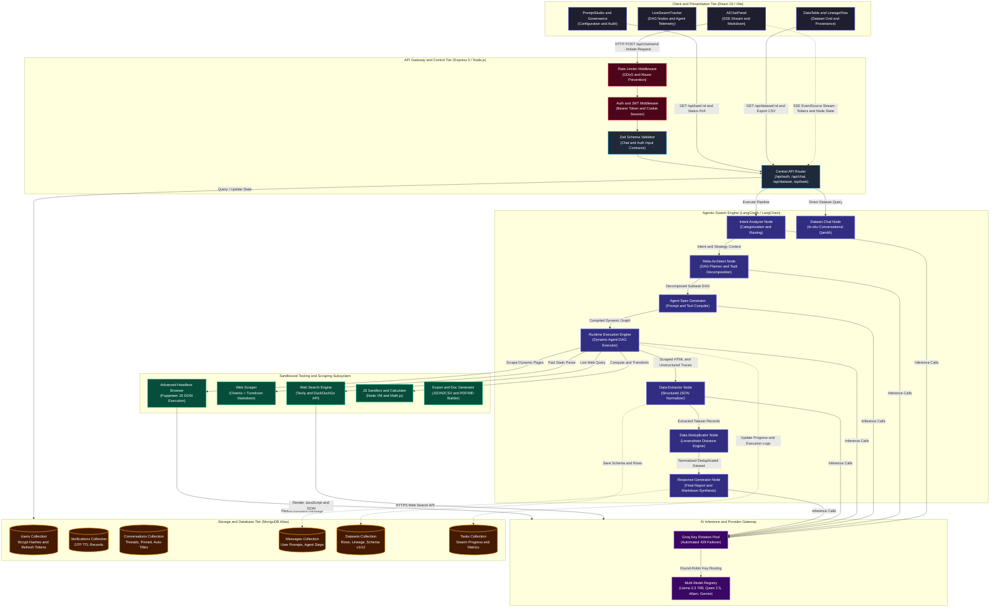
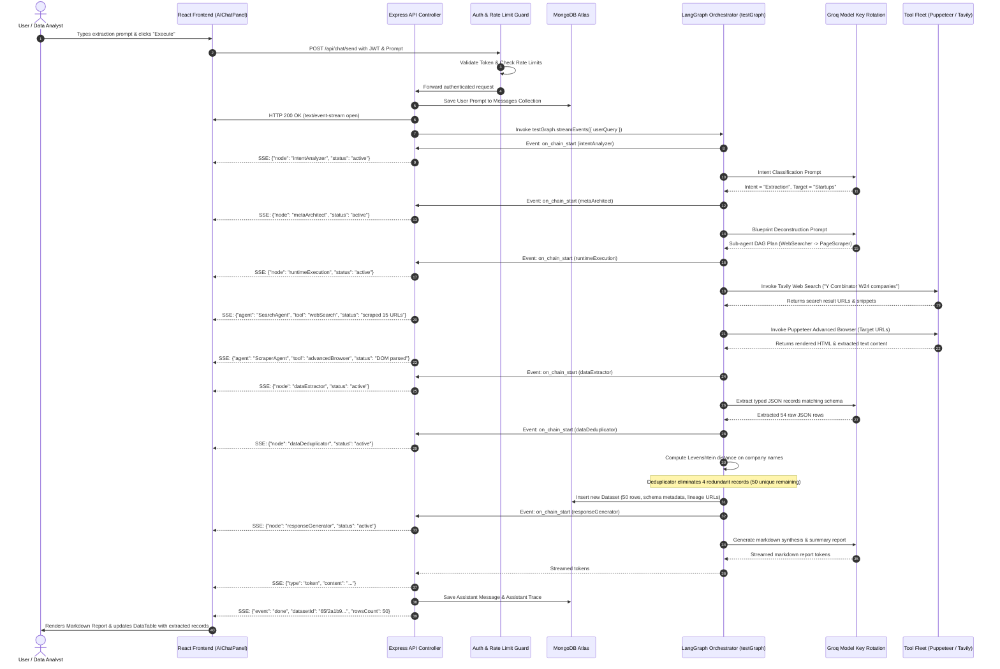
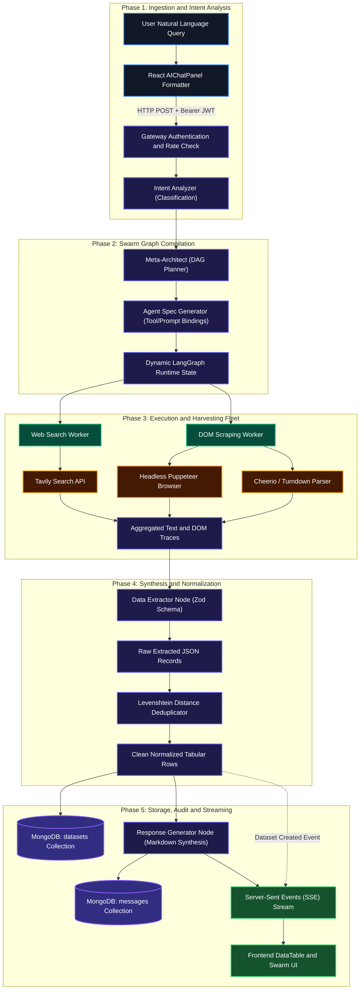
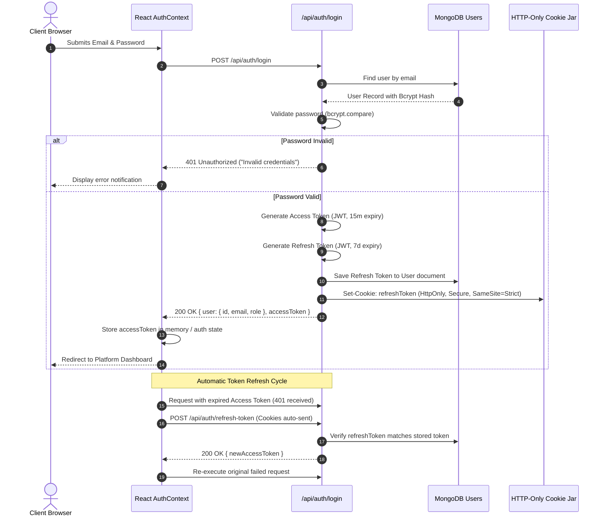
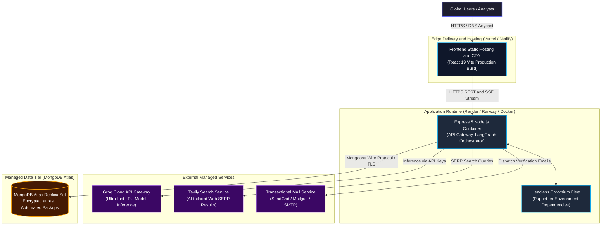
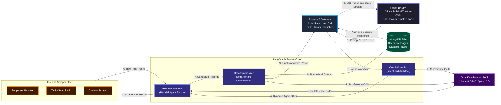

# Autonomous Agentic Data Engineering & Swarm Intelligence Platform
## Production-Grade System Architecture & Execution Flow Specification

---

## 1. Project Overview

### 1.1 Executive Summary
The **Autonomous Agentic Data Engineering & Swarm Intelligence Platform** is an enterprise-ready, multi-agent AI system designed to autonomously extract, structure, validate, deduplicate, and analyze high-volume, multi-source unstructured web and enterprise data. Built on top of **Node.js (Express 5)**, **LangChain / LangGraph**, **MongoDB (Mongoose 9)**, and **React 19 (Vite)**, the platform replaces brittle manual web scrapers and static ETL pipelines with a dynamic compiler and runtime swarm orchestrator.

When a user submits a natural-language data request (e.g., *"Extract top 50 AI startups from Y Combinator W24 with founders, funding stage, and tech stack"*), the platform:
1. Deconstructs the intent via an **Intent Analyzer Node**.
2. Dynamically architects a tailored multi-agent Directed Acyclic Graph (DAG) via a **Meta-Architect Node**.
3. Compiles executable agent specifications and tool bindings via an **Agent Specification Generator**.
4. Spawns and executes an autonomous agent swarm via a **Runtime Execution Engine** equipped with headless browsers (Puppeteer), web search engines (Tavily/DuckDuckGo), HTML/Markdown parsers (Cheerio/Turndown), and sandboxed code execution (VM/mathjs).
5. Harvests semi-structured traces, synthesizes them into normalized records via a **Data Extractor Node**, and eliminates redundancies using fuzzy Levenshtein distance metrics via a **Data Deduplicator Node**.
6. Streams live execution logs and DAG state transitions to the frontend in real time via **Server-Sent Events (SSE)**.
7. Persists versioned datasets in MongoDB with full data lineage and provides interactive dataset querying (**Dataset Chat**), schema review, and multi-format exports (CSV, JSON).

```
User (Browser Client)
       │
       ▼ [HTTPS / WSS / SSE]
Vite + React 19 Frontend SPA (Live Swarm Tracker & Data Lineage)
       │
       ▼ [REST API / SSE Streams + JWT Bearer Auth]
Express 5 API Gateway & Routing Tier (Rate Limiter, Auth Middleware, Zod Validation)
       │
       ▼ [State Graph Invocation]
LangGraph Swarm Compiler & Dynamic Execution Engine
       │
       ├──► Meta-Architect & Agent Swarm Workers (Puppeteer, Tavily, Cheerio, JS VM)
       ├──► Resilient Model Gateway (Groq API Key Rotation Pool & Multi-Model Registry)
       └──► Data Extraction & Levenshtein Fuzzy Deduplication Pipeline
       │
       ▼ [Read / Write / Lineage Audit]
MongoDB Atlas Persistence Tier (Users, Conversations, Messages, Tasks, Datasets)
```

### 1.2 Target Users & Roles
- **Data Engineers & Analysts**: Requiring rapid, automated data extraction, cleaning, and schema mapping without writing custom scrapers.
- **Market Researchers & Intelligence Teams**: Requiring real-time aggregation of competitive intelligence, social signals, and corporate filings.
- **Enterprise Administrators**: Monitoring agent swarm resource utilization, token consumption, audit logs, and rate limit health.

### 1.3 Core Business Logic
- **Autonomous Intent-to-Swarm Compilation**: Automatically translating free-form language into a typed, dependency-validated execution graph of specialized sub-agents.
- **Dynamic Tool Federation**: Providing agents with just-in-time tools (browser scraping, deep search, calculation, sandbox scripting) governed by strict input-output validation schemas.
- **Zero-Loss Data Lineage**: Storing origin URLs, agent execution traces, confidence scores, and transformation histories alongside every extracted tabular row.
- **Resilient AI Inference**: Automated key rotation across multi-provider Groq pools to eliminate HTTP 429 rate limit stalls during high-concurrency swarm runs.

---

## 2. System Architecture

### 2.1 Architecture Explanation
The architecture follows a modular, decoupled tier topology:
- **Presentation Tier (Frontend)**: React 19 single-page application (SPA) styled with custom dark-mode cybernetic aesthetics. Communicates with the backend via Axios (REST) with automated JWT refresh token interceptors, and an EventSource/fetch-based SSE stream for live agent telemetry.
- **Application & Gateway Tier (Backend)**: Express 5 server featuring centralized CORS, Morgan request tracing, custom in-memory rate limiting, Zod schema validation middleware, and dual-token JWT authentication (15-minute access tokens + 7-day HTTP-only refresh cookies).
- **Agentic Orchestration & AI Engine Tier**: Built on LangGraph state machines. Coordinates the end-to-end extraction lifecycle via compiled LangGraph workflows (`testGraph` and `chatGraph`), leveraging a dynamic model registry with Groq API key rotation.
- **Tool Sandbox & Browser Engine**: Headless Puppeteer browser cluster for client-side JavaScript rendering, Cheerio/Turndown for lightweight static scraping, and Math.js / sandboxed JS VMs for runtime analytical computations.
- **Persistence Tier (Database)**: MongoDB replica set managed via Mongoose 9 schemas for Users, OTP Verifications, Conversations, Messages, Long-running Tasks, and Versioned Datasets.

### 2.2 System Architecture Diagram



### 2.3 Component Responsibilities

| Component | Logical Layer | Technical Basis | Primary Responsibility |
| :--- | :--- | :--- | :--- |
| **`AIChatPanel`** | Frontend Presentation | React 19, Markdown parser | Streams real-time tokens, user inputs, displays tabular data preview and agent states. |
| **`LiveSwarmTracker`** | Frontend Presentation | React 19, Lucide Icons | Visualizes the active execution nodes and live thoughts of autonomous sub-agents. |
| **`DataTable` & `ExportModal`** | Frontend Presentation | React 19, Virtualized Table | Enables sorting, filtering, searching, and exporting dataset rows into CSV/JSON. |
| **`API Gateway / Router`** | Gateway / Middleware | Express 5, CORS, Morgan | Directs incoming traffic, enforces CORS policies, and coordinates route controllers. |
| **`RateLimiter`** | Gateway Security | `express-rate-limit` | Protects backend against denial-of-service and brute force API key exhaustion. |
| **`Auth Middleware`** | Gateway Security | `jsonwebtoken`, `cookie-parser` | Validates Bearer access JWTs and auto-checks HTTP-only refresh tokens. |
| **`Intent Analyzer`** | LangGraph Node | Groq Llama-3.3-70B / Zod | Classifies user intent (Extraction vs. Research vs. Chat vs. In-situ Dataset Q&A). |
| **`Meta-Architect`** | LangGraph Node | Groq Llama-3.3-70B | Plans multi-agent workflows, generates dependency blueprints, and maps tool needs. |
| **`Agent Spec Generator`** | LangGraph Node | LangChain Core / Prompting | Creates isolated agent personas, instruction blocks, and binds specific tools. |
| **`Runtime Execution`** | LangGraph Node | LangGraph Dynamic Graph | Dynamically compiles and executes parallel/sequential agent workers. |
| **`Advanced Browser`** | Tooling Subsystem | Puppeteer (Headless Chrome) | Handles SPA execution, dynamic DOM navigation, cookie bypass, and screen evaluation. |
| **`Web Scraper & Search`** | Tooling Subsystem | Tavily, Cheerio, Turndown | Executes rapid search queries and transforms raw HTML pages into clean Markdown. |
| **`Data Extractor`** | LangGraph Node | Zod Structured Parsing | Transforms unstructured text traces into schema-adherent JSON record arrays. |
| **`Data Deduplicator`** | LangGraph Node | `fastest-levenshtein` | Computes string similarity across candidate primary keys to eliminate duplicate rows. |
| **`Groq Rotation Pool`** | AI Provider Gateway | Custom Round-Robin Manager | Rotates through configured Groq API keys upon detection of HTTP 429 rate limits. |
| **`MongoDB Mongoose Tier`** | Persistence Tier | MongoDB Atlas, Mongoose 9 | Enforces schema validation and transactional storage for users, chats, and datasets. |

---

## 3. Core Swarm Execution Pipeline

### 3.1 Execution Explanation
The core feature of the system is the **Autonomous Multi-Agent Extraction & Deduplication Pipeline**. When an extraction prompt is processed:
1. **User Request & SSE Handshake**: The user inputs a prompt via `AIChatPanel`. The client initiates an HTTP POST to `/api/chat/send`. The server immediately sets SSE headers (`text/event-stream`, `Cache-Control: no-cache`) to hold the connection open.
2. **Context & History Retrieval**: The message is stored in `messages`. If this is a new session, `conversations` is populated with an automatically generated session title.
3. **Intent Classification (`intentAnalyzer`)**: The prompt is processed to detect user intent (Extraction, Analytical, Conversational). The server emits an SSE event `node_start: intentAnalyzer`.
4. **Graph Blueprinting (`metaArchitect`)**: The architect decomposes the problem into required sub-agents (e.g., `SearchAgent`, `ScraperAgent`, `ValidatorAgent`), planning their inputs, outputs, and dependencies.
5. **Agent Dynamic Compilation (`agentSpecificationGenerator` -> `runtimeExecution`)**: Specialized sub-agents are compiled into an executable LangGraph runtime DAG with dedicated tool access (Puppeteer, Tavily, Cheerio).
6. **Parallel Agent Execution**: Sub-agents execute tools, scrape live URLs, inspect DOM content, and accumulate raw facts in `agentTrace`. Live log tokens and tool calls are piped to the client over SSE.
7. **Structured Extraction (`dataExtractor`)**: The raw gathered traces are passed to the extractor node, which infers or validates the target schema and extracts structured tabular rows.
8. **Fuzzy Deduplication (`dataDeduplicator`)**: Candidate rows are evaluated using Levenshtein distance on primary identifiers (e.g., entity name, URL, email). Duplicate records are merged or discarded.
9. **Persistence & Synthesis (`responseGenerator`)**: The structured rows are saved to MongoDB in `datasets` with full source lineage. A comprehensive summary markdown report is generated and streamed to the user.
10. **SSE Completion**: The server emits an `end_stream` event containing the final payload and closes the SSE channel.

### 3.2 Sequence Diagram



### 3.3 Synchronous vs. Asynchronous Operations
- **Synchronous Operations**:
  - JWT credential verification and token renewal.
  - Request body validation against Zod schemas.
  - SSE connection establishment and HTTP header negotiation.
  - Insertion of initial user message record in MongoDB.
- **Asynchronous (Streaming) Operations**:
  - Multi-agent LangGraph graph traversal (`testGraph.streamEvents`).
  - Headless Puppeteer browser instantiation, dynamic page navigation, and DOM rendering.
  - External search API round-trips (Tavily/DuckDuckGo).
  - Groq LLM inference with round-robin key failover.
  - Algorithmic Levenshtein deduplication matrices.
  - Storage of high-cardinality dataset rows and audit lineage in MongoDB.

---

## 4. Feature-by-Feature Architecture

### 4.1 Feature: Autonomous Swarm Data Extraction
- **What it does**: Translates unstructured web content into fully structured, normalized tabular datasets based on user prompts.
- **Components involved**:
  - Frontend: `AIChatPanel.jsx`, `LiveSwarmTracker.jsx`
  - Gateway: `/src/modules/chat/chat.controller.js`
  - Engine: `intent.node.js`, `architect.node.js`, `runtime.node.js`, `dataExtractor.node.js`
  - Tooling: `advancedBrowser.tool.js`, `webSearch.tool.js`, `webScraper.tool.js`
  - Database: `datasets`, `messages`
- **Execution Flow**:
  1. User enters data extraction request.
  2. Gateway establishes SSE channel.
  3. `intentAnalyzer` tags query as `DATA_EXTRACTION`.
  4. `metaArchitect` generates multi-agent task execution graph.
  5. `runtimeNode` executes sub-agents with browser tools to harvest source data.
  6. `dataExtractor` structures raw text into typed JSON fields.
  7. Dataset persisted to MongoDB; UI table refreshed.
- **API Endpoint**: `POST /api/chat/send`

### 4.2 Feature: Levenshtein Fuzzy Deduplication
- **What it does**: Eliminates duplicate or near-duplicate entity rows across diverse scraped sources using edit-distance thresholds.
- **Components involved**:
  - Engine: `dataDeduplicator.node.js`
  - Algorithm: `fastest-levenshtein`
  - Database: `datasets`
- **Execution Flow**:
  1. Receives extracted row array from `dataExtractor`.
  2. Identifies candidate primary key columns (e.g., `name`, `title`, `url`).
  3. Calculates normalized Levenshtein similarity score between pairs:
     $$\text{Similarity}(s_1, s_2) = 1 - \frac{\text{Distance}(s_1, s_2)}{\max(|s_1|, |s_2|)}$$
  4. Merges records exceeding confidence threshold (default: $0.85$) while preserving complementary attributes.
  5. Outputs clean dataset to `responseGenerator`.
- **API Endpoint**: Internal node execution within `POST /api/chat/send`.

### 4.3 Feature: In-Situ Dataset Chat & Querying
- **What it does**: Allows users to chat directly with an extracted dataset to ask statistical, qualitative, or analytical questions without re-scraping the web.
- **Components involved**:
  - Frontend: `AIChatPanel.jsx`, `DataTable.jsx`
  - Gateway: `/src/modules/dataset/dataset.controller.js`
  - Engine: `datasetChat.node.js`, `databaseAnalytics.tool.js`, `calculator.tool.js`
  - Database: `datasets`
- **Execution Flow**:
  1. User selects an existing dataset and asks: *"What is the average funding raised by fintech startups in this table?"*
  2. Gateway fetches target dataset records from MongoDB.
  3. `datasetChat.node.js` constructs context window with schema and data slice.
  4. If numerical aggregation is needed, `calculator.tool.js` or `databaseAnalytics.tool.js` is triggered.
  5. Synthesized answer returned to client.
- **API Endpoints**:
  - `GET /api/dataset/:id`
  - `POST /api/dataset/:id/chat`

### 4.4 Feature: Dataset Export & Lineage Audit
- **What it does**: Exports extracted datasets into CSV/JSON formats and provides an interactive visual audit graph showing the origin of every row.
- **Components involved**:
  - Frontend: `ExportModal.jsx`, `DataLineageFlow.jsx`
  - Gateway: `/src/modules/dataset/dataset.controller.js`
  - Tooling: `json2csv`, `fileStorage.js`
  - Database: `datasets`
- **Execution Flow**:
  1. User clicks "Export CSV" on `DataTable`.
  2. Frontend sends export request with column filter parameters.
  3. Gateway parses JSON records from MongoDB and converts them to standard RFC-4180 CSV via `json2csv`.
  4. Content returned with `Content-Disposition: attachment; filename="dataset.csv"`.
- **API Endpoints**:
  - `GET /api/dataset/:id/export?format=csv`
  - `GET /api/dataset/:id/export?format=json`
  - `GET /api/dataset/:id/lineage`

---

## 5. Data Flow Architecture



---

## 6. Database Architecture

The persistence layer is implemented in **MongoDB Atlas** using **Mongoose 9** schemas.

```
Users
 ├── _id (ObjectId)
 ├── username (String, Unique)
 ├── email (String, Unique, Indexed)
 ├── password (String, Bcrypt Hash)
 ├── role (Enum: 'user', 'admin')
 ├── isVerified (Boolean)
 ├── refreshToken (String, Nullable)
 └── createdAt, updatedAt (Timestamps)

Verifications
 ├── _id (ObjectId)
 ├── userId (Ref: Users, Indexed)
 ├── email (String)
 ├── otp (String, Bcrypt Encrypted)
 ├── type (Enum: 'verify_email', 'reset_password')
 └── expiresAt (Date, TTL Index: 10m)

Conversations
 ├── _id (ObjectId)
 ├── userId (Ref: Users, Indexed)
 ├── title (String, Auto-generated)
 ├── isArchived (Boolean, Default: false)
 ├── pinned (Boolean, Default: false)
 ├── lastMessageAt (Date, Indexed)
 └── createdAt, updatedAt (Timestamps)

Messages
 ├── _id (ObjectId)
 ├── conversationId (Ref: Conversations, Indexed)
 ├── sender (Enum: 'user', 'assistant', 'system')
 ├── content (String)
 ├── metadata (Object: tokenCount, activeNode, executionTrace)
 └── createdAt (Timestamp)

Datasets
 ├── _id (ObjectId)
 ├── userId (Ref: Users, Indexed)
 ├── conversationId (Ref: Conversations, Indexed)
 ├── name (String)
 ├── schemaDefinition (Array: fieldName, dataType, isNullable)
 ├── rows (Array of Objects, Primary Extracted Entities)
 ├── lineage (Object: sourceUrls, agentSequence, executionTimeMs)
 ├── version (Number, Default: 1)
 └── createdAt, updatedAt (Timestamps)

Tasks
 ├── _id (ObjectId)
 ├── userId (Ref: Users, Indexed)
 ├── title (String)
 ├── status (Enum: 'PENDING', 'RUNNING', 'COMPLETED', 'FAILED')
 ├── progress (Number, 0 to 100)
 ├── agentCount (Number)
 ├── executionLogs (Array: timestamp, node, message, level)
 └── createdAt, updatedAt (Timestamps)
```

### 6.1 Database Indexes & Optimizations
- **Compound Indexes**:
  - `Messages`: `{ conversationId: 1, createdAt: 1 }` for rapid linear chat history queries.
  - `Datasets`: `{ userId: 1, createdAt: -1 }` for fast dashboard dataset listings.
  - `Conversations`: `{ userId: 1, pinned: -1, lastMessageAt: -1 }` for sidebar ordering.
- **TTL Index**:
  - `Verifications`: `{ expiresAt: 1 }` with `expireAfterSeconds: 0` ensures automatic garbage collection of expired OTPs.

---

## 7. AI & LLM Orchestration Architecture

```
User Prompt
    │
    ▼
Intent Analyzer Node ──► [Groq Llama-3.3-70B]
    │
    ▼
Meta-Architect Node ──► [Groq Llama-3.3-70B] (Decompose to Subtasks)
    │
    ▼
Agent Specification Generator ──► [Prompt Templates + Tool Catalogs]
    │
    ▼
Dynamic Runtime Execution ──► [Parallel Sub-Agents with Browser & Search Tools]
    │
    ▼
Data Extractor Node ──► [Zod Structured Extraction Schema]
    │
    ▼
Data Deduplicator Node ──► [Levenshtein String Distance Matcher]
    │
    ▼
Response Generator Node ──► [Groq Synthesis & Markdown Formatter]
```

### 7.1 Groq API Key Rotation Pool & Resilience Gateway
To prevent rate limiting (HTTP 429) during parallel swarm execution, backend implements a round-robin rotation pool (`src/config/groqRotation.js`):
- Maintains multiple valid Groq API keys loaded from environment variables (`GROQ_API_KEY_1`, `GROQ_API_KEY_2`, ...).
- Monitors error codes: Upon encountering `rate_limit_exceeded` or HTTP `429`, the pool automatically increments the key index, logs a warning with Winston, and executes an immediate retry via `src/utils/retryWithRateLimit.js`.
- Automatically implements exponential backoff with jitter when all keys in the pool reach quota limits.

### 7.2 Multi-Model Registry
Models are registered with standardized capability interfaces (`src/ai/models/registry.js`):
- **Groq Llama-3.3-70B-Versatile**: Primary reasoning model for `intentAnalyzer`, `metaArchitect`, and `responseGenerator`.
- **Groq Qwen-2.5-32B / Llama-3.1-8B-Instant**: High-throughput extraction and deduplication helper.
- **Google Gemini 2.0 Flash / Pro**: Optional secondary fallback provider configured via environment variables.

---

## 8. Web Scraping & Tool Execution Subsystem

The platform features a specialized tool execution engine operating within secure sandboxes:

```
Runtime Engine
  ├── Tavily Search Tool ──► High-precision SERP search across live web
  ├── Cheerio Scraper Tool ──► High-speed static HTML extraction & Turndown Markdown
  ├── Puppeteer Browser Tool ──► Headless Chrome (Dynamic SPA rendering, DOM selectors)
  ├── JS Execution Tool ──► Isolated Node.js VM context (Sanitized math & transforms)
  └── Database Analytics Tool ──► Statistical operations (averages, distributions, sums)
```

1. **`advancedBrowser.tool.js` (Puppeteer)**:
   - Spawns headless Chromium with flags `--no-sandbox`, `--disable-setuid-sandbox`, `--disable-dev-shm-usage`.
   - Intercepts requests to block heavy advertising/tracking assets (images, stylesheets, fonts) to minimize memory consumption and maximize scraping speed.
   - Waits for network idle (`domcontentloaded`) before harvesting DOM text content.
2. **`webScraper.tool.js` (Cheerio + Turndown)**:
   - Fetches lightweight pages via Axios with randomized user-agents.
   - Converts HTML tables, lists, and articles into clean Markdown to reduce LLM token count by up to $80\%$.

---

## 9. Background Job & Long-Running Task Architecture

For large extractions requiring multiple scraping passes across dozens of URLs:

```
Client (Prompt Studio)
    │
    ▼ POST /api/task/create
API Gateway
    │
    ├──► Creates Task Record in MongoDB (Status: PENDING)
    │
    ▼ [Async Dispatch]
Task Execution Runner
    │
    ├── Updates Task Status: RUNNING (Progress: 10%)
    │
    ├── Spawns LangGraph Swarm Pipeline
    │     │
    │     ├── Agent 1 (Searcher): Scrapes Index Pages (Progress: 35%)
    │     ├── Agent 2 (Detail Scraper): Scrapes Product Pages (Progress: 70%)
    │     └── Agent 3 (Deduplicator): Normalizes Entities (Progress: 90%)
    │
    ├── Saves Finished Dataset to MongoDB
    │
    ▼ Updates Task Status: COMPLETED (Progress: 100%)
Client Polling / SSE Status Updates
```

- **Task Statuses**: `PENDING` $\rightarrow$ `RUNNING` $\rightarrow$ `COMPLETED` / `FAILED`.
- **Fail-Safe Mechanism**: Unhandled exceptions inside worker sub-agents are captured by `errorHandler.js`, writing diagnostic logs into the task's `executionLogs` array and marking status as `FAILED` without crashing the Express server.

---

## 10. Authentication & Authorization Flow



- **Password Security**: Bcrypt with 10 salt rounds.
- **Access Token**: Stored in React application memory; expires in 15 minutes.
- **Refresh Token**: Stored in a strict `HttpOnly`, `SameSite=Strict` cookie; expires in 7 days.
- **Role-Based Access**: Role field (`user` vs `admin`) verified via `src/middleware/auth.js`.

---

## 11. Error Handling & Failure Recovery

| Failure Scenario | Detection Mechanism | Immediate Action | Recovery Strategy |
| :--- | :--- | :--- | :--- |
| **Groq API Rate Limit (429)** | Axios / LangGraph error interceptor | Pause current node execution | Rotate to next key in `groqRotation.js`; apply exponential jitter backoff. |
| **Target Website Blocks Scraper (403/CAPTCHA)** | Puppeteer / Cheerio error code | Abort static scrape request | Fallback to headless Puppeteer with randomized User-Agent and viewport evasion. |
| **Malformed JSON from LLM** | Zod parse failure in `dataExtractor` | Log raw hallucination text | Trigger `extractHallucinatedJsonTool.js` regex recovery heuristic to parse valid JSON slice. |
| **MongoDB Connection Loss** | Mongoose `disconnected` event | Queue outgoing writes in buffer | Mongoose auto-reconnect with 5-second retry interval; log fatal alert via Winston. |
| **Client Disconnects Mid-Stream** | Express `req.on('close')` event | Terminate SSE stream write | Cancel ongoing downstream LangChain agent stream to conserve token quota. |
| **Invalid User Input** | Express Zod validator middleware | Reject request at gateway level | Return structured HTTP 400 Bad Request with field-level validation errors. |

---

## 12. Security Architecture

1. **Network & Transport Security**:
   - Production enforcement of HTTPS / TLS 1.3.
   - CORS middleware restricted strictly to authorized origins (`CLIENT_URL` / `http://localhost:5173`).
2. **Authentication & Session Defense**:
   - Short-lived Access Tokens (15 min) mitigate token theft risk.
   - Refresh tokens stored exclusively in `HttpOnly`, `Secure` cookies inaccessible to client-side XSS scripts.
3. **Application & Input Sanitization**:
   - Strict Zod schema validation on all inbound JSON payloads prevents parameter pollution.
   - System prompts include rigid output demarcations to defend against prompt injection from scraped web text.
4. **Tool Execution Isolation**:
   - Sandboxed VM contexts for dynamic mathematical or JS script execution.
   - Puppeteer runs in sandboxed browser instances with local file access strictly disabled.
5. **Rate Limiting**:
   - Central rate-limiter prevents brute-force login attempts and API abuse.

---

## 13. Monitoring & Observability

```
Operational Logging Architecture:
  ├── Morgan HTTP Middleware ──► Inbound request method, URL, status code, latency
  ├── Winston Logger ──► Timestamped structured logs (console + daily log files)
  ├── Task Execution Tracker ──► Granular agent step audit trail in MongoDB
  └── Client Telemetry ──► Live node status streamed via SSE to LiveSwarmTracker
```

- **Metrics Tracked**:
  - Node latency across `intentAnalyzer`, `metaArchitect`, and `runtimeExecution`.
  - Token consumption per model invocation.
  - Active Groq API key rotation index and failure counts.
  - Number of extracted rows and deduplication reduction ratios.

---

## 14. Deployment Architecture



- **Frontend Hosting**: Vercel or Netlify serving static assets through global edge CDN.
- **Backend Runtime**: Containerized Node.js (Docker) on Railway / Render / AWS ECS, packaged with Chromium binaries.
- **Database**: MongoDB Atlas M10+ multi-zone replica set with automated backups.

---

## 15. Complete User Journey

```
1. Access & Authentication
   └── User opens web app, submits credentials, receives JWT, redirected to workspace.

2. Intent & Extraction Prompting
   └── User types data extraction query into AIChatPanel and clicks Submit.

3. Real-Time Swarm Activation
   └── UI displays LiveSwarmTracker.
   └── SSE streams active node transitions: Intent -> Meta-Architect -> Spec Generator -> Runtime.

4. Autonomous Web Harvesting
   └── Agents invoke Tavily search and launch Puppeteer to scrape targeted URLs.
   └── Real-time agent thought logs displayed in UI.

5. Normalization & Deduplication
   └── Raw text parsed into structured JSON records.
   └── Levenshtein deduplication eliminates redundant records.

6. Presentation & Persistence
   └── Extracted dataset stored in MongoDB with lineage audit trail.
   └── Markdown summary streamed to chat; records rendered in interactive DataTable.

7. Analysis & Export
   └── User inspects source URLs in SourceInspectorDrawer.
   └── User chats with dataset via Dataset Chat node.
   └── User exports final dataset to CSV or JSON format.
```

---

## 16. Component Responsibility Matrix

| Component | Responsibility | Primary Input | Primary Output | Downstream Consumers |
| :--- | :--- | :--- | :--- | :--- |
| **`AIChatPanel`** | User chat UI & stream rendering | User input text, SSE events | Rendered tokens, Markdown | End user |
| **`LiveSwarmTracker`** | Visual DAG execution tracking | SSE lifecycle events | Interactive agent nodes | End user |
| **`DataTable`** | Interactive dataset inspection | Extracted JSON rows array | Filtered / sorted table | End user, `ExportModal` |
| **`Auth Controller`** | User credential management | Login / Register payloads | JWTs, Refresh Cookies | `AuthContext` |
| **`Chat Controller`** | Orchestration gateway | Message text, conversation ID | SSE Event Stream | `AIChatPanel` |
| **`Intent Analyzer`** | Classify query nature | Raw user prompt | Intent classification enum | `Meta-Architect` |
| **`Meta-Architect`** | Plan multi-agent DAG | Intent, user requirements | Agent blueprint graph | `Agent Spec Gen` |
| **`Agent Spec Gen`** | Bind tools and prompts | Agent blueprint graph | Compiled executable specs | `Runtime Engine` |
| **`Runtime Engine`** | Execute multi-agent graph | Compiled agent specs | Unstructured raw traces | `Data Extractor` |
| **`Puppeteer Tool`** | Dynamic web DOM scraping | Target URL, selectors | Clean page HTML / text | `Runtime Engine` |
| **`Tavily Tool`** | Live web search | Query string | Ranked search results | `Runtime Engine` |
| **`Data Extractor`** | Structured data normalization | Unstructured agent traces | Structured JSON rows array | `Data Deduplicator` |
| **`Data Deduplicator`** | Fuzzy entity deduplication | Extracted JSON rows array | Deduplicated records | `Response Gen`, MongoDB |
| **`Response Gen`** | Final report synthesis | Deduplicated records | Markdown summary report | Chat Controller, SSE |
| **`Dataset Model`** | Persistent dataset storage | Normalized rows, lineage | Mongoose query results | `DataTable`, Export Tool |

---

## 17. Complete End-to-End Architecture


